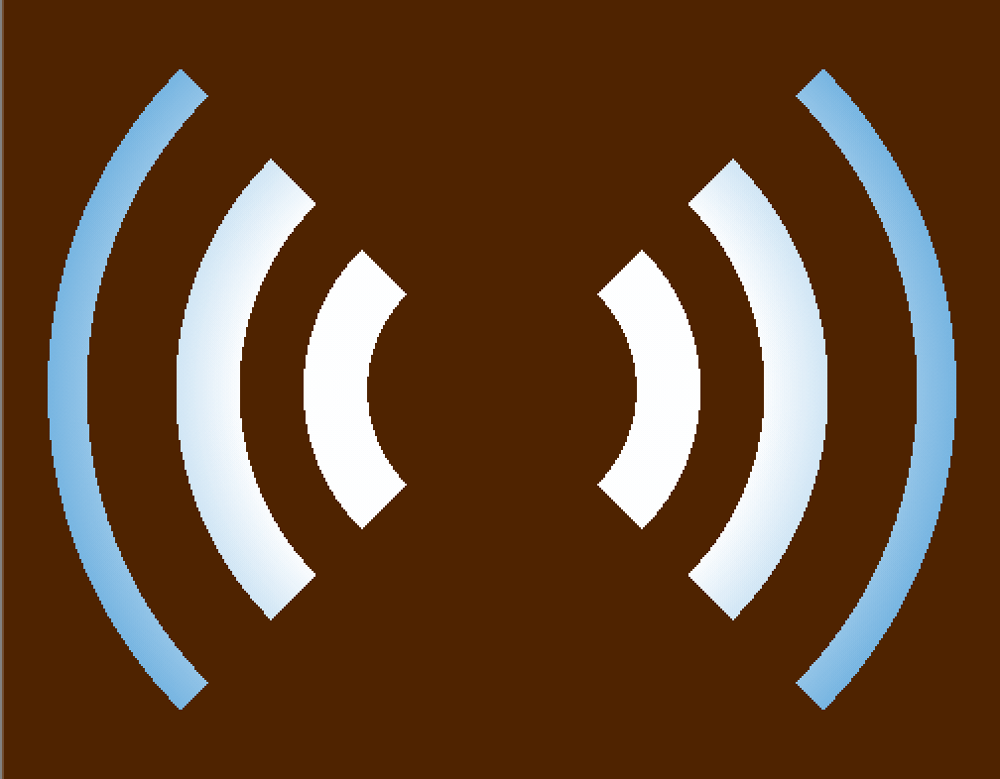

# concentric-radio-waves
A 2D concentric-radio-waves effect.

## Install

From your unity project folder:

    npm init # only if you don't yet have a package.json in your project
    npm install beatthat/concrentric-radio-waves --save

## Usage

Look under `Assets/Samples/beatthat/concentric-radio-waves` for an example setup that you can copy elswhere in your project.

...change colors using the `ColorCenter` and `ColorEdge` material properties

...change shape using the `HeightDegrees` property

...change cutout using the `ClipCenterPct` property

